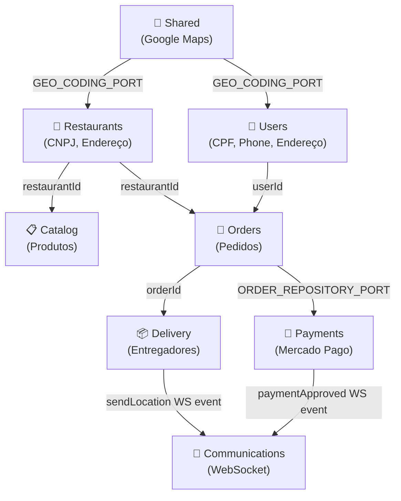

# 🍔 App Food Backend — Clone do iFood

Backend de delivery de comida construído com **NestJS**, **TypeORM**, **PostgreSQL**, **Socket.IO** e integração com **Mercado Pago** e **Google Maps**, seguindo os princípios de **Clean Architecture** e **Domain-Driven Design (DDD)**.

---

## 📖 Para Iniciantes — A Analogia da Praça de Alimentação

Imagine que este sistema é uma gigante **Praça de Alimentação de um Shopping**. Dentro dela, existem "departamentos" independentes que se comunicam apenas por "fichinhas de identificação" (IDs numéricos).

| Departamento | Responsabilidade |
|:---|:---|
| 🧑 **Users** | A recepção onde os clientes se cadastram (com CPF, telefone e endereço) |
| 🏪 **Restaurants** | O cadastro das lanchonetes e suas localizações no mapa |
| 📋 **Catalog** | O cardápio com todos os produtos de cada restaurante |
| 🛵 **Orders** | O balcão de pedidos que registra o que foi pedido e por quanto |
| 📦 **Delivery** | O controle dos entregadores e o status das entregas |
| 📡 **Communications** | O rádio em tempo real que avisa todo mundo sobre tudo |
| 💸 **Payments** | O caixa automático integrado ao Mercado Pago |

**A Regra de Ouro:** Nenhum departamento "entra na sala" de outro pelo banco de dados. Eles só trocam o número da fichinha (ex: `userId: 1`). Quem orquestra o relacionamento é a lógica de negócio, nunca o banco!

---

## 🏛️ Arquitetura do Sistema

```
src/
├── app.module.ts                 # Módulo raiz da aplicação
├── main.ts                       # Bootstrap do servidor
├── shared/                       # ← Pasta compartilhada (ver seção dedicada abaixo)
│   ├── shared.module.ts
│   ├── ports/
│   │   └── geo-coding.port.ts    # Interface do serviço de geolocalização
│   ├── adapters/
│   │   └── google-maps.adapter.ts # Implementação real do Google Maps
│   ├── config/
│   │   └── env.validation.ts     # Validação de variáveis de ambiente no startup
│   └── typeorm/
│       └── config/orm.config.ts  # Configuração do banco de dados
│
└── contexts/                     # ← Os 7 Bounded Contexts (departamentos)
    ├── users/
    ├── restaurants/
    ├── catalog/
    ├── orders/
    ├── delivery/
    ├── communications/
    └── payments/
```

Cada contexto segue a mesma estrutura interna em 4 camadas:

```
contexts/[nome]/
├── domain/              # 🧠 Regras de negócio puras (sem framework, sem banco)
│   ├── entities/        # Entidades de domínio
│   └── value-objects/   # Objetos de Valor (CPF, Email, CNPJ, Phone...)
├── application/         # 🎯 Casos de uso e portas de abstração
│   ├── ports/           # Interfaces (contratos) para repositórios e serviços externos
│   └── use-cases/       # A lógica de cada ação do sistema
├── infrastructure/      # 🔧 Implementações concretas (banco, APIs externas)
│   ├── database/        # Schemas TypeORM e Repositórios
│   ├── adapters/        # Adaptadores para serviços externos
│   └── providers/       # Provedores (ex: Bcrypt)
└── presentation/        # 🌐 Interface HTTP (Controllers + DTOs)
    ├── controllers/
    └── dtos/
```

---

## 📦 Explicação de Cada Contexto

### 1. 🧑 `users/` — Usuários e Clientes

**Responsabilidade:** Cadastro, autenticação e gerenciamento de clientes da plataforma.

**Value Objects de Domínio:**
- **`CPF`** — Valida o algoritmo real dos dígitos verificadores brasileiros. Armazena 11 dígitos e formata com `getFormatted()` → `"123.456.789-09"`
- **`Email`** — Garante formato de e-mail válido
- **`Password`** — Encapsula a senha com suporte a hash (Bcrypt)
- **`Phone`** — Valida 11 dígitos e fornece `getLastFourDigits()` para o código de verificação de entrega

**Como se conecta com outros contextos:**
- Fornece `userId` para os contextos de `Orders` e `Delivery`
- Endereços do usuário têm `lat/lng` para o Google Maps calcular fretes
- Os últimos 4 dígitos do `phone` são copiados para `orders.deliveryVerificationCode` no ato da compra

---

### 2. 🏪 `restaurants/` — Restaurantes e Estabelecimentos

**Responsabilidade:** Cadastro e gerenciamento dos restaurantes parceiros.

**Value Objects de Domínio:**
- **`CNPJ`** — Valida o formato do CNPJ brasileiro com regex

**Como se conecta:**
- Fornece `restaurantId` para `Catalog` (produtos) e `Orders` (pedidos)
- Endereços têm `lat/lng` que são usados para calcular a distância até o cliente via Google Maps Routes API

---

### 3. 📋 `catalog/` — Catálogo de Produtos

**Responsabilidade:** Gerenciar o cardápio (produtos) de cada restaurante.

**Como se conecta:**
- Armazena `restaurantId` como referência isolada (sem FK no TypeORM)
- Quando um pedido é feito, `Orders` faz uma **cópia imutável** do `name` e `price` do produto. Isso garante que se o restaurante alterar o preço amanhã, o pedido de hoje não muda!

---

### 4. 🛵 `orders/` — Pedidos

**Responsabilidade:** O núcleo do negócio. Registra os pedidos dos clientes.

**Ciclo de vida de um pedido:**
```
AWAITING_PAYMENT → (webhook aprovado) → PREPARING → (restaurante pronto) → DISPATCHED → DELIVERED
```

**Como se conecta:**
- Usa `userId` (de Users) e `restaurantId` (de Restaurants) como referências isoladas
- Exporta `ORDER_REPOSITORY_PORT` para o contexto de `Payments` atualizar o status via webhook
- Armazena `deliveryVerificationCode` (4 últimos dígitos do telefone no ato da compra)

---

### 5. 📦 `delivery/` — Entregas e Entregadores

**Responsabilidade:** Controlar as entregas e os entregadores.

**Dados geográficos:**
- `destLat` / `destLng` — Coordenadas do destino (preenchidas via Google Maps Geocoding)
- `distanceMeters` — Distância da rota calculada pelo Google Maps Routes API
- `estimatedDurationSeconds` — Tempo estimado de entrega em segundos

**Como se conecta:**
- Referencia `orderId` para saber qual pedido está sendo entregue
- Usa o `TrackingGateway` (de Communications) para enviar localização em tempo real via WebSocket

---

### 6. 📡 `communications/` — Comunicação em Tempo Real

**Responsabilidade:** Gerenciar a comunicação em tempo real entre cliente, restaurante e entregador.

**Implementação:** Socket.IO via `@nestjs/websockets`

**Salas (Rooms):** `order_{orderId}` — Todos os participantes de um pedido ficam na mesma sala isolada.

**Eventos disponíveis:**
| Evento | Direção | Descrição |
|:---|:---|:---|
| `joinOrderRoom` | Client → Server | Entrar na sala do pedido |
| `sendLocation` | Entregador → Server | Enviar GPS atual |
| `locationUpdate` | Server → Sala | Repassar GPS para todos na sala |
| `sendChatMessage` | Qualquer → Server | Enviar mensagem de chat |
| `chatMessage` | Server → Sala | Repassar mensagem para todos na sala |
| `paymentApproved` | Server → Sala | Notificar aprovação do pagamento |

**Como se conecta:**
- `TrackingGateway` é exportado para o contexto de `Payments` disparar eventos quando o pagamento é aprovado

---

### 7. 💸 `payments/` — Pagamentos com Mercado Pago

**Responsabilidade:** Integrar com o Mercado Pago para geração de cobranças e processamento de webhooks.

**Fluxo completo:**
1. `POST /payments/checkout` → Gera Pix (código copia-e-cola + QR Code Base64)
2. Cliente paga pelo app do banco
3. Mercado Pago envia webhook para `POST /payments/webhook`
4. `ProcessWebhookUseCase` valida com a API do Mercado Pago (evita fraude)
5. Se aprovado: atualiza `PaymentSchema.status = APPROVED`, `OrderSchema.status = PREPARING`
6. Dispara evento WebSocket `paymentApproved` no canal `order_{id}`

**Modo Simulado:** Sem `MERCADOPAGO_ACCESS_TOKEN` no `.env`, o sistema gera dados fictícios automaticamente para desenvolvimento.

---

## 📁 A Pasta `shared/` — Por que ela existe?

A pasta `shared` resolve um problema clássico de projetos modulares: **"Onde coloco código que qualquer módulo pode precisar usar?"**

Em DDD, cada contexto (bounded context) deve ser autossuficiente. Mas alguns serviços de infraestrutura são genuinamente transversais — como um serviço de geolocalização que tanto o contexto de `Users` quanto o de `Restaurants` pode precisar usar.

```
shared/
├── shared.module.ts          # Módulo NestJS que exporta os serviços compartilhados
├── ports/
│   └── geo-coding.port.ts    # CONTRATO: define o que um serviço de geo deve fazer
├── adapters/
│   └── google-maps.adapter.ts # IMPLEMENTAÇÃO: usa Google Maps para cumprir o contrato
├── config/
│   └── env.validation.ts     # Valida variáveis de ambiente obrigatórias no startup
└── typeorm/
    └── config/orm.config.ts  # Configuração centralizada do banco de dados
```

**A chave da boa arquitetura aqui:** o `shared` não "sabe" quem vai usá-lo. Ele expõe **interfaces (Ports)** e **implementações (Adapters)**, seguindo o mesmo padrão de Clean Architecture usado nos contextos.

> ⚠️ **O que NÃO deve ir em `shared`:** Regras de negócio específicas de um contexto (ex: "a lógica de validar o CPF de um usuário") devem ficar dentro do próprio contexto `users/domain/`.

---

## 🗺️ Como os Contextos se Conectam



> **Importante:** As setas indicam **referência por ID**, nunca por chave estrangeira TypeORM (`@ManyToOne`) cruzando módulos. O banco de dados desconhece esses relacionamentos — eles existem apenas na lógica da aplicação.

---

## 🔐 Segurança e Variáveis de Ambiente

### Configuração do `.env`

Crie um arquivo `.env` na raiz do projeto (baseado no `.env.example`):

```env
# Servidor
PORT=3000
NODE_ENV=development

# Banco de Dados
DB_HOST=localhost
DB_PORT=5432
DB_USERNAME=postgres
DB_PASSWORD=postgres
DB_DATABASE=food_db

# Mercado Pago — https://www.mercadopago.com.br/developers
MERCADOPAGO_ACCESS_TOKEN=seu_token_aqui

# Google Maps — https://console.cloud.google.com/apis/credentials
# Ative: Geocoding API + Routes API (ou Directions API)
GOOGLE_MAPS_API_KEY=sua_chave_aqui
```

> **Nunca** versione o arquivo `.env` no git! O `.env.example` já está configurado e é seguro versionar.

### Modos Simulados (Fallback)

O sistema tem **fallback automático** para desenvolvimento sem chaves reais:

| Serviço | Com chave | Sem chave |
|:---|:---|:---|
| Mercado Pago | Cobranças Pix reais | Mock: gera dados fictícios |
| Google Maps | Geocoding real + Rotas reais | Mock: coordenadas aleatórias próximas a SP |

---

## 🚀 Como Rodar Localmente

### Pré-requisitos
- Node.js 18+
- PostgreSQL 14+
- Git

### Passo a passo

```bash
# 1. Clone o repositório
git clone <url-do-repo>
cd app_food_backend

# 2. Instale as dependências
npm install

# 3. Configure o ambiente
cp .env.example .env
# Edite o .env com seus dados do banco e chaves de API

# 4. Crie o banco de dados no PostgreSQL
# O TypeORM com synchronize:true criará as tabelas automaticamente em desenvolvimento

# 5. Rode em modo de desenvolvimento
npm run start:dev

# O servidor estará disponível em: http://localhost:3000
```

---

## 📡 Rotas HTTP Disponíveis

### 👤 Users
| Método | Rota | Descrição |
|:---:|:---|:---|
| `POST` | `/users` | Cadastrar novo usuário (requer CPF) |
| `GET` | `/users` | Listar todos os usuários |
| `GET` | `/users/:id` | Buscar usuário por ID |
| `PATCH` | `/users/:id` | Atualizar dados do usuário |
| `DELETE` | `/users/:id` | Remover usuário |
| `POST` | `/auth/login` | Autenticar (retorna token JWT) |

### 🏪 Restaurants
| Método | Rota | Descrição |
|:---:|:---|:---|
| `POST` | `/restaurants` | Cadastrar restaurante (CNPJ obrigatório) |
| `GET` | `/restaurants` | Listar restaurantes |
| `PATCH` | `/restaurants/:id` | Atualizar restaurante |
| `DELETE` | `/restaurants/:id` | Remover restaurante |

### 📋 Catalog
| Método | Rota | Descrição |
|:---:|:---|:---|
| `POST` | `/products` | Criar produto no catálogo |
| `GET` | `/products` | Listar produtos |
| `PATCH` | `/products/:id` | Atualizar produto |
| `DELETE` | `/products/:id` | Remover produto |

### 🛵 Orders
| Método | Rota | Descrição |
|:---:|:---|:---|
| `POST` | `/orders` | Criar pedido |
| `GET` | `/orders` | Listar pedidos |
| `GET` | `/orders/:id` | Buscar pedido |

### 💸 Payments
| Método | Rota | Descrição |
|:---:|:---|:---|
| `POST` | `/payments/checkout` | Gerar cobrança Pix para um pedido |
| `POST` | `/payments/webhook` | Receber notificação do Mercado Pago |

### 📡 WebSocket (Socket.IO)
| Evento | Tipo | Descrição |
|:---|:---:|:---|
| `joinOrderRoom` | Emit | Entrar na sala do pedido |
| `sendLocation` | Emit | Enviar localização GPS |
| `sendChatMessage` | Emit | Enviar mensagem de chat |
| `locationUpdate` | Listen | Receber atualização de GPS |
| `chatMessage` | Listen | Receber mensagem de chat |
| `paymentApproved` | Listen | Pagamento aprovado — pedido em preparo |

---

## 🧠 Decisões de Arquitetura

### Por que DDD?
As regras do negócio (como: "CPF deve ser válido", "O preço do pedido deve ser imutável", "Apenas pedidos em AWAITING_PAYMENT podem ser pagos") vivem na camada `domain`, completamente independente de banco de dados, frameworks ou APIs externas. Isso torna o sistema testável, evolutivo e fácil de entender.

### Por que sem UUID?
IDs numéricos auto-incremento são mais simples, performáticos em queries e mais fáceis de usar em ferramentas de desenvolvimento (como o Postman). Em um sistema de delivery, a legibilidade do ID (`Pedido #1024`) é mais importante que sua opacidade.

### Por que sem `@ManyToOne` cruzando módulos?
Chaves estrangeiras cruzando contextos criam acoplamento no banco de dados. Se o módulo `Orders` tiver uma FK apontando para a tabela `users`, você não pode mover esses módulos para microsserviços separados no futuro, nem escalar o banco de forma independente. Ao usar apenas IDs numéricos, os contextos permanecem verdadeiramente independentes.

### Por que Ports & Adapters para Mercado Pago e Google Maps?
Se amanhã você decidir trocar o Mercado Pago pela Stone, ou o Google Maps pelo Mapbox, você só precisa criar um novo Adapter. Os seus Use Cases, Entidades e Controllers continuam sem nenhuma alteração.
